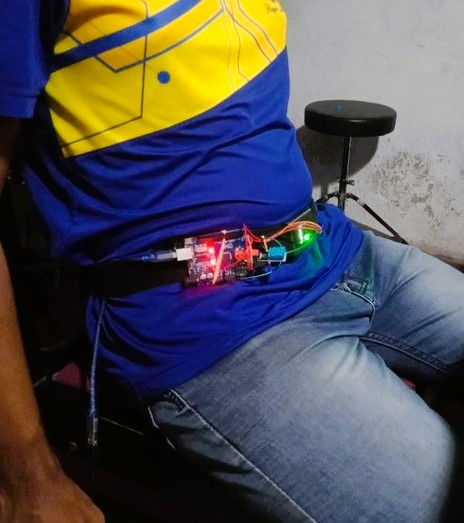

# Fall Detection Device for Elderly People

This project is a fall detection system designed to monitor and detect falls in elderly individuals. The system uses an Arduino ATmega328p microcontroller and an MPU 6050 sensor to capture motion data. The data is processed using a K-Nearest Neighbors (KNN) machine learning algorithm to differentiate between normal activities (walking, sitting, sleeping) and fall events.

## Overview

This fall detection system is intended to provide a reliable method of detecting falls, a common and serious problem among the elderly. The device captures acceleration and gyroscope data using the MPU 6050 sensor and processes the data with a KNN algorithm, which has been trained to recognize different activities, including falls.

## Features

- **High Accuracy**: Achieved 96% accuracy on the test set.
- **Real-time Monitoring**: Continuously monitors the user's movements and detects falls.
- **Lightweight and Portable**: Built with Arduino ATmega328p for easy deployment.

  

## Hardware Components

- **Arduino ATmega328p**: The microcontroller used to process sensor data and run the KNN algorithm.
- **MPU 6050 Sensor**: A 6-axis motion sensor that provides acceleration and gyroscope data.

## Software Components

- **Arduino IDE**: Used for programming the Arduino ATmega328p.
- **Python (for ML Model Training)**: Used to train the KNN model with collected data.
- **Libraries**:
  - sklearn
  - Numpy
  - Pandas

## Setup and Installation

1. **Arduino IDE Setup**:
   - Download and install the Arduino IDE from [Arduino's official website](https://www.arduino.cc/en/software).
   - Install necessary libraries (`Wire.h`, `MPU6050.h`).

2. **Sensor Calibration**:
   - Connect the MPU 6050 sensor to the Arduino.

3. **Machine Learning Model**:
   - Collect data for different activities (walking, sitting, sleeping, falling) using the MPU 6050 sensor.
   - Use Python to train the KNN algorithm on this data.
   - Deploy the trained model on the Arduino for real-time fall detection.

## Usage

1. **Power the Device**:
   - Connect the device to a power source.
   
2. **Wear the Device**:
   - Attach the device to the body, ensuring the MPU 6050 sensor is securely in place.

3. **Monitoring**:
   - The device will start monitoring movements and detect any falls.
   - An alert can be triggered in case of a detected fall (optional feature).
     
## Result
  Best accuray of 0.93939393 was obatained when k = 30 for the test set. in use case of the device, 63% fallings are identified correctly.

## Acknowledgments

This project was a team effort, and I would like to acknowledge the contributions of the following members:

- **Dilan Madhusankha**
- **Lakshan Dayawansha**
- **Chamod Samarum**
- **Theminda Samarakoon**

## License

This project is licensed under the MIT License - see the [LICENSE](LICENSE) file for details.
